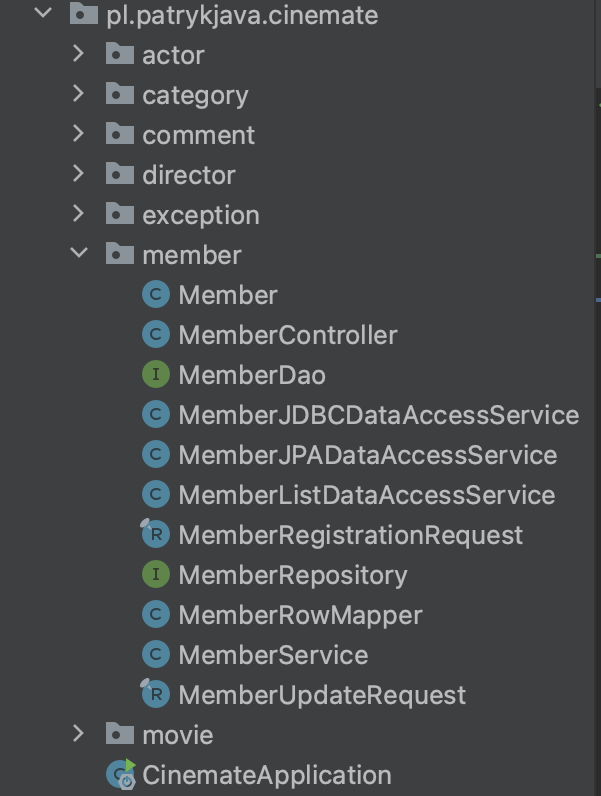
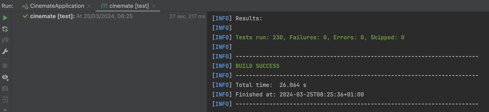
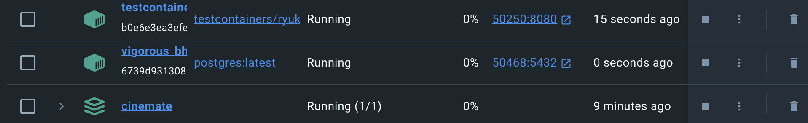
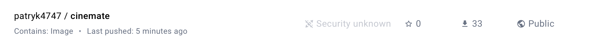
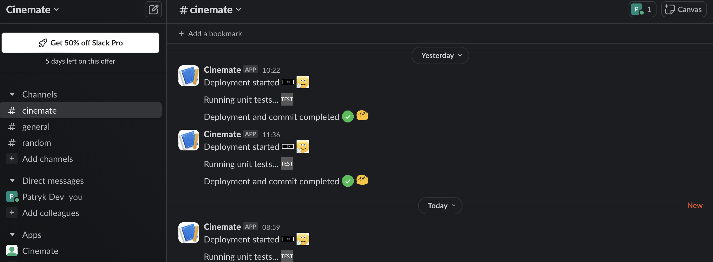

# 🎬 Cinemate - Your Ultimate Movie Companion


* [📝 Description](#description)
  * [Overview](#overview)
  * [Discover the Features](#discoverfeatures)
* [🔧 Technologies & Frameworks](#technologies)
* [📸 ✨ Implementation details & Screenshots](#implementation)
* [🚀 How to Run?](#howtorun)
  * [Database](#database)
  * [Project](#project)
* [📸 Screenshots](#screenshots)
* [📋 TO-DO List](#todo)

## <a name="description"></a> 📝 Description

### <a name="overview"></a> Overview

Welcome to Cinemate - Your Ultimate Movie Companion, where you can immerse yourself in the world of movies and explore a vast collection of films from various genres and eras. Cinemate is your go-to platform for discovering new movies, learning about your favorite actors and directors, and keeping track of your movie watchlist.

Cinemate is designed to provide users with a seamless and intuitive experience, offering a plenty of features to enhance your movie-watching journey. From browsing movie details to leaving reviews and recommendations, Cinemate has everything you need to fuel your passion for cinema.

Whether you're a casual moviegoer or a dedicated film buff, Cinemate has something for everyone. Join us and embark on a cinematic adventure like never before!

### <a name="discoverfeatures"></a> Discover the Features

🎥 Extensive Movie Database: Dive into our extensive collection of movies spanning various genres, directors, and actors. With thousands of titles at your fingertips, you'll never run out of options.

📜 Detailed Movie Information: Explore in-depth details about each movie, including plot summaries, cast and crew information, ratings, reviews, and more.

📚 User Reviews and Ratings: Share your thoughts and opinions by leaving reviews and ratings for your favorite movies. Engage with other users and contribute to the vibrant Cinemate community.

🔍 Advanced Search Functionality: Find the perfect movie with our powerful search feature, allowing you to filter by title, genre, year, and more.

## <a name="technologies"></a> 🔧 Technologies & Frameworks

Cinemate leverages the following technologies and frameworks to deliver an unparalleled movie-watching experience:

🚀 Backend:

* Java 21 📚
* Spring Boot 🏃
* Spring Data JPA (Hibernate) 🗃️
* Spring Security (+JWT) 🔒
* PostgreSQL Database 📊
* Docker 🐳
* Flyway 🛫
* JUnit 5 🧪
* Mockito 🃏
* Maven 🛠️

🎨 Frontend:

* We are currently working on it! 😊

These cutting-edge tools come together seamlessly to power up our movie companion platform.

## <a name="implementation"></a> 📸 ✨ Implementation details & Screenshots

* #### Project file structure -> Package by Feature


* #### Tests are very important - that's why at this moment, before even running first version of our app, we currently have **+200 tests** :)


* #### Docker containers (after running maven:test, it is creating Testcontainers)


* #### CI (Continuous Integration) in action (via GitHub Actions)


* #### CD (Continuous Deployment) in action (via Docker hub)


* #### Slack in action!



## <a name="howtorun"></a> 🚀 How to Run?

* ### <a name="project"></a> Project

1. Clone this git repository: `$ git clone https://github.com/patryk47853/Cinemate.git`
2. Fetch all Maven dependencies.
3. That's it! Cinemate will be available at `http://localhost:8080/`.
<br>

* ### <a name="database"></a> Database

1. Visit the "application.properties" file and update the following fields:

`spring.datasource.username=YOUR_USERNAME`
<br>
`spring.datasource.password=YOUR_PASSWORD`

with your PostgreSQL database credentials.

2. Run the PostgreSQL database using Docker with the following command:

`docker-compose up -d

`

3. *(Optional) Rename `V2_Insert_Initial_Data` to `V2__Insert_Initial_Data` to insert Initial Data to the database. When you run your application, Flyway will initialize this data for you. :)

Database will be automatically initalized through Flyway :)

* ### Viewing Database Details

#### Terminal Access

To view details of your database via the terminal, follow these steps:

1. Navigate to the root folder of your project in the terminal.

2. Run the following command to enter the Docker container:
    ```
    docker exec -it cinemate bash
    ```

3. Once inside the container, access the PostgreSQL command line interface by typing:
    ```
    psql -U postgres cinemate_db
    ```

4. To see the contents of a specific table, execute:
    ```
    SELECT * FROM <table_name>;
    ```

5. To exit the PostgreSQL command line interface, type:
    ```
    \q
    ```

#### PGAdmin4 Access

To view database details using PGAdmin4, perform the following steps:

1. Open PGAdmin.

2. In the Browser panel on the left side, right-click on "Servers" and select "Create" -> "Server...".

3. In the "General" tab of the "Create - Server" dialog, provide the following details:
  - Enter a name for your server in the "Name" field (e.g., "Cinemate DB").

4. In the "Connection" tab, fill in the following information:
  - For "Host name/address", enter localhost.
  - For "Port", enter 5332 (mapped from host port 5332 to container port 5432).
  - For "Maintenance database", enter postgres or the name of your database if different.
  - For "Username", enter cinemate or the username configured for your PostgreSQL database.
  - For "Password", enter admin123 or the password configured for your PostgreSQL database.

5. Click "Save" to save the server configuration.

Now you can explore your database details conveniently using PGAdmin4.

### Note:
- Make sure Docker is running before accessing the database via the terminal.
- Adjust the port numbers and credentials if they differ from the provided example.
- Replace `<table_name>` with the actual name of the table you want to view.

## <a name="todo"></a> 📋 TO-DO List

- [ ] Implement basic frontend for better User Experience!
- [x] Implemet Movie entity and fully test it.
- [ ] Create controllers and test access to them.
- [x] Expand database to include more comprehensive movie metadata.
- [x] Add Spring Security to enable users to securely utilize the initial version of our application!

Stay tuned for exciting updates and new features coming soon!
