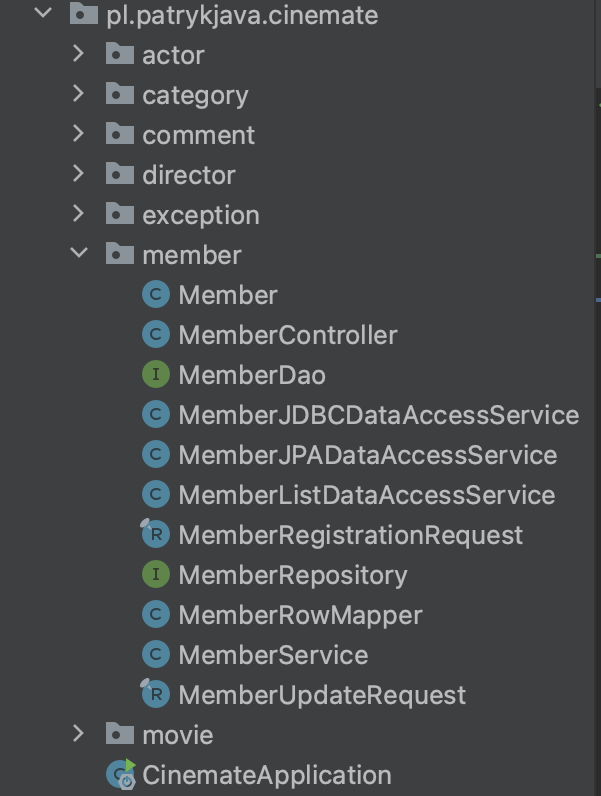
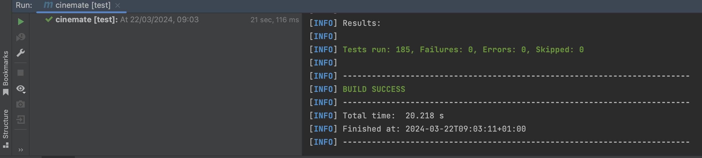
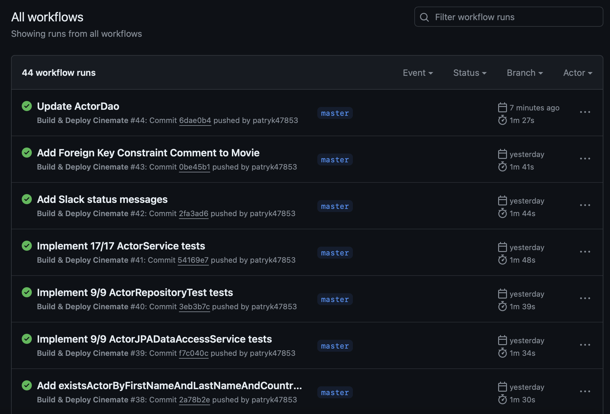

# 🎬 Cinemate - Your Ultimate Movie Companion

 

* [📝 Description](#description)
  * [Overview](#overview)
  * [Discover the Features](#discoverfeatures)
* [🔧 Technologies & Frameworks](#technologies)
* [📸 ✨ Implementation details & Screenshots](#implementation)
* [🚀 How to Run?](#howtorun)
  * [Database](#database)
  * [Project](#project)
* [📸 Screenshots](#screenshots)
* [📋 TO-DO List](#todo)

##  📝 Description

###  Overview

Welcome to Cinemate - Your Ultimate Movie Companion, where you can immerse yourself in the world of movies and explore a vast collection of films from various genres and eras. Cinemate is your go-to platform for discovering new movies, learning about your favorite actors and directors, and keeping track of your movie watchlist.

Cinemate is designed to provide users with a seamless and intuitive experience, offering a plenty of features to enhance your movie-watching journey. From browsing movie details to leaving reviews and recommendations, Cinemate has everything you need to fuel your passion for cinema.

Whether you're a casual moviegoer or a dedicated film buff, Cinemate has something for everyone. Join us and embark on a cinematic adventure like never before!

###  Discover the Features

🎥 Extensive Movie Database: Dive into our extensive collection of movies spanning various genres, directors, and actors. With thousands of titles at your fingertips, you'll never run out of options.

📜 Detailed Movie Information: Explore in-depth details about each movie, including plot summaries, cast and crew information, ratings, reviews, and more.

📚 User Reviews and Ratings: Share your thoughts and opinions by leaving reviews and ratings for your favorite movies. Engage with other users and contribute to the vibrant Cinemate community.

🔍 Advanced Search Functionality: Find the perfect movie with our powerful search feature, allowing you to filter by title, genre, year, and more.

##  🔧 Technologies & Frameworks

Cinemate leverages the following technologies and frameworks to deliver an unparalleled movie-watching experience:

🚀 Backend:

* Java 21 📚
* Spring Boot 🏃
* Spring Data JPA (Hibernate) 🗃️
* PostgreSQL Database 📊
* Docker 🐳
* Flyway 🛫
* JUnit 5 🧪
* Mockito 🃏
* Maven 🛠️

🎨 Frontend:

* We are currently working on it! 😊

These cutting-edge tools come together seamlessly to power up our movie companion platform.

##  📸 ✨ Implementation details & Screenshots

### (To be reformatted)

* #### Project file structure

* #### Tests are very important - that's why at this moment, before even running first version of our app, we currently have **185 tests** :)

* #### Docker containers (after running maven:test, it is creating Testcontainers)

* #### CI/CD in action (via GitHub Actions)

* #### Docker Hub (successfully deployeed app to Docker Hub)

* #### Slack in action!

##  🚀 How to Run?

* ###  Database

1. Visit the "application.properties" file and update the following fields:

`spring.datasource.username=YOUR_USERNAME`
 
`spring.datasource.password=YOUR_PASSWORD`

with your PostgreSQL database credentials.

2. Run the PostgreSQL database using Docker with the following command:

`docker-compose up -d

`

Database will be automatically initalized through Flyway :)

* ###  Project

1. Clone this git repository: `$ git clone https://github.com/patryk47853/Cinemate.git`
2. Fetch all Maven dependencies.
3. That's it! Cinemate will be available at `http://localhost:8080/login`.

##  📋 TO-DO List

- [ ] Implement basic frontend for better User Experience!
- [ ] Implemet Movie entity and fully test it.
- [ ] Create controllers and test access to them.
- [ ] Expand database to include more comprehensive movie metadata.
- [ ] Add Spring Security to enable users to securely utilize the initial version of our application!

Stay tuned for exciting updates and new features coming soon!
